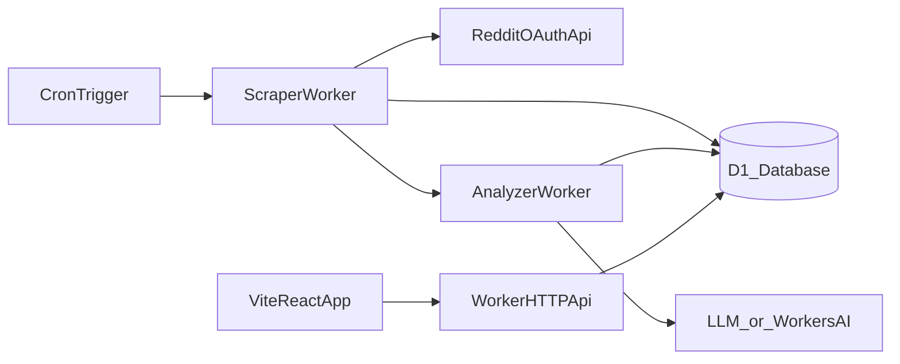

# Reddit Scraper + AI Micro-SaaS Generator Plan

## Tech choice (Python vs Node)

- **Pick: TypeScript/Node (Cloudflare Workers runtime)**.
- **Why**: your repo is already TS (Vite/React) and you chose Cloudflare for runtime; Workers run JS/TS natively, with built-in scheduling, secrets, and D1 bindings.

## High-level architecture

## Data ingestion (posts + comments)

- **Reddit API access**: OAuth script app credentials stored as Cloudflare Secrets.
- **Fetch strategy**:
  - Pull posts using listing endpoints (`/r/{sub}/new`) with pagination (`after`) until `created_utc` is older than the window cutoff (24h/7d/30d).
  - For each post, fetch comments via `/comments/{id}` and store:
    - post metadata
    - comments (at least top-level + a configurable depth/limit for speed)
- **Anti-blocking**: API-first means no “human-like” scraping required; we’ll still:
  - set a compliant `User-Agent`
  - obey rate limits (token bucket)
  - add jitter + exponential backoff

## Speed + time-window optimization

- **Incremental scrapes** per subreddit:
  - store a checkpoint (`last_seen_created_utc` and/or `last_after_cursor`) per window
  - each scheduled run continues from checkpoint and stops when it reaches cutoff
- **Concurrency controls**:
  - parallelize comment fetches with a small cap (e.g. 3–8 concurrent) to avoid rate limiting
- **Selective comment loading** (configurable):
  - speed mode: only top N comments or only top-level
  - deep mode: more depth for better signal

## Storage (Cloudflare D1)

Add D1 tables to support:

- **subreddits**: tracked subs + scrape preferences (window, comment depth, limits)
- **scrape_runs**: run metadata, timings, errors
- **posts** and **comments**: raw content + timestamps + references
- **pain_points**: extracted problem statements + evidence (post/comment ids)
- **clusters**: grouped recurring problems + metrics
- **ideas**: micro‑SaaS ideas generated from clusters + scoring

## AI pipeline (pain points → clusters → ideas)

- **Step A: extraction**: turn each post/comment into 0–N “problem statements” (short, normalized)
- **Step B: dedupe/cluster**:
  - create embeddings for problem statements
  - cluster (e.g., incremental cosine similarity grouping)
- **Step C: idea generation**:
  - for each cluster, generate:
    - concise problem summary
    - who has it
    - suggested micro‑SaaS solution
    - differentiators
    - MVP scope
    - acquisition angle
- **LLM provider default**:
  - **Option 1 (recommended on Cloudflare): Workers AI**
  - **Option 2: OpenAI** (swapable via env vars)

## Worker/API endpoints (for the frontend)

- `GET /api/subreddits` / `POST /api/subreddits`
- `POST /api/scrape/run` (manual trigger)
- `GET /api/analyses` (list)
- `GET /api/analyses/:id` (detail: clusters + ideas + evidence)

## Frontend integration

Leverage existing pages:

- [`src/pages/Subreddits.tsx`](src/pages/Subreddits.tsx) to manage tracked subreddits + window
- [`src/pages/AnalysesList.tsx`](src/pages/AnalysesList.tsx) and [`src/pages/AnalysisDetail.tsx`](src/pages/AnalysisDetail.tsx) to display clusters/ideas and drill into evidence

## Reliability/“flawless” operation

- **Retries** with exponential backoff for Reddit/LLM calls
- **Idempotent writes** (upserts on post/comment ids) so reruns don’t duplicate
- **Observability**: store run status + error messages in `scrape_runs`, log structured events

## Proxy fallback (only if needed later)

- With the official API, you usually won’t need proxies.
- If Reddit API limits become an issue for specific subreddits, we’ll add:
  - more aggressive caching + incremental paging
  - optional paid API provider
  - only as last resort: residential proxy + headless browser path (separate worker/service)

## Files we’ll likely add/change

- [`wrangler.toml`](wrangler.toml) for D1 + scheduled triggers + bindings
- `functions/api/*.ts` (or a dedicated worker entry) for HTTP API + cron
- `src/lib/reddit.ts` OAuth + fetch helpers
- `src/lib/scraper/*.ts` scrape logic
- `src/lib/analysis/*.ts` extraction + clustering + idea generation
- pages/components to wire UI to new API

## Implementation todos

- Configure Reddit OAuth + Cloudflare bindings/secrets
- Add D1 schema + migration
- Implement scraper worker (posts + comments + checkpoints)
- Implement AI pipeline (extract, cluster, generate ideas)
- Add API routes + frontend screens to browse results
- Add run logs + basic health checks